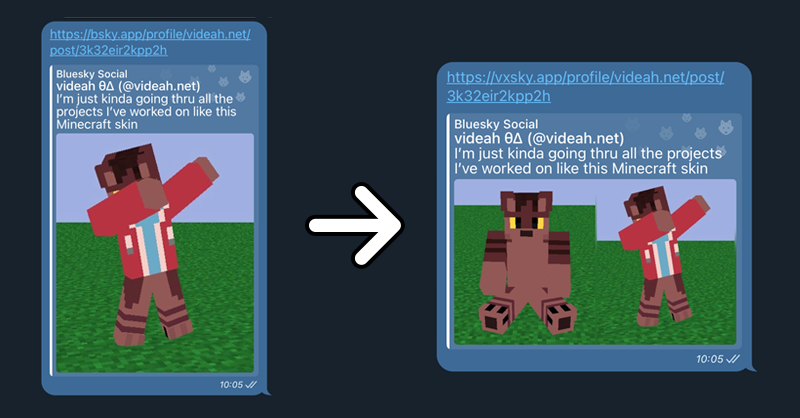

# vxsky.app

Improves multi-image embeds for Bluesky by combining all images into one thumbnail.
Simply replace `bsky.app` with `vxsky.app` in your URLs!

Inspired by the work of [dylanpdx](https://github.com/dylanpdx) on [BetterTwitFix](https://github.com/dylanpdx/BetterTwitFix).